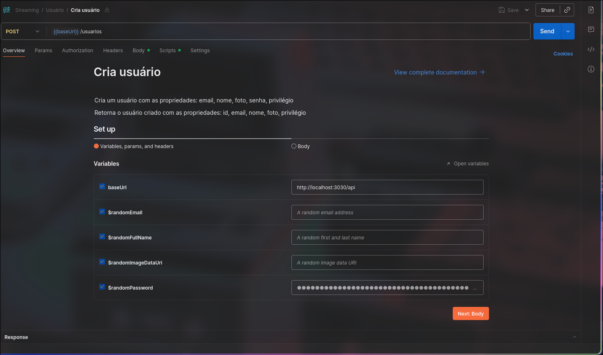

# Streaming de Músicas: Modelagem e CRUD com Prisma 🎵

## Introdução 🚩
A atividade consiste na modelagem de um banco de dados que simule um serviço de streaming de músicas, e na criação de uma API no modelo MVC para consultar o banco, permitindo realização das operações CRUD sobre suas entidades.

## Instalação e Execução ▶️
Para instalar, primeiro é necessário clonar o repositório
```
git clone https://github.com/victor-arcuri/ijunior-streaming.git
cd ijunior-streaming 
```
Com o repositório clonado, é necessário criar um arquivo `.env` segundo o template de `.env.template`

Após a criação do `.env` e definição das variáveis de ambiente, é necessário subir os containers com Docker Compose
```
docker compose up
```
Com isso, a API está incializada na porta definida e rodando!

## Documentação da API e Testes de Endpoint
> A documentação listando todos os endpoints da API e formatos dos objetos requeridos em requisições pode ser encontrada [aqui](https://documenter.getpostman.com/view/47365760/2sB3BDLX3H)


> Os testes de Endpoints com client de API Postman podem ser encontrados [aqui](https://www.postman.com/otaviol-8493235/workspace/trainee-ijunior/collection/47365760-c04f666c-fe2d-44d5-b303-288676edb279?action=share&source=copy-link&creator=47365760)



## Modelagem do Banco 📝
O banco de dados retrata três entidades principais e suas relações:


### Autenticação
Padrão refresh-token

### Entidades

#### Usuário
O usuário é aquele que irá interagir diretamente com a plataforma e utilizar seus recursos.

Como elementos principais, possui:

- **id**: representa seu identificador único na tabela
- **email**: email único registrado por cada usuário
- **nome**: nome do usuário
- **privilegio**: nível de acesso aos recursos da plataforma, podendo ser (PADRAO, ou ADMIN)
- **senha**: senha para acessar a conta do usuário
- **foto**: url para a foto de perfil do usuário

#### Artista
O artista é aquele que lança as músicas. Seu perfil é representativo, e não é acessado diretamente por um usuário, apenas servindo para agrupar suas músicas.

Como elementos principais, possui:

- **id**: representa seu identificador único na tabela
- **nome**: nome artístico
- **streams**: número de vezes que escutaram suas músicas
- **foto**: url para foto de perfil do artista

#### Música
A música é o centro do serviço, sendo lançada sob autoria dos artistas e podendo ser salva pelos usuários e também escutada por eles

Como elementos principais, possui:

- **id**: representa seu identificador único na tabela
- **nome**: nome da música
- **genero**: o gênero musical da publicação
- **album**: sob qual album, se não for um single, a música foi lançada

### Relações

#### Autoria
A tabela de autoria representa a relação entre uma música e um (ou mais) artistas, sendo caracterizada por quem publicou uma música. (1->N)

#### Logs
Os logs representam quando um usuário ouviu uma música, guardando o momento no tempo exato em que isso ocorreu. É uma relação de uma música para um usuário (n->n)

#### Músicas Salvas
Representa as músicas favoritadas por um usuário. É uma relação de uma música para um usuário (n->n)

## Orientações 🗒️

### Semana 05
O projeto se inicia na semana 05, a partir da modelagem do banco e início da criação da API, com apenas services para opereações básicas de CRUD. 

Suas orientações podem ser encontradas no Notion com mais detalhes [nesse link](https://www.notion.so/ijunior/Atividade-M-os-obra-23dc39c4674680e49aa1c6099ff31c9f).

#### Objetivos 
- [X] Criar e configurar o repositório do projeto
- [X] Inicializar a estrutura do prisma 
- [X] Modelar o banco de dados 
- [X] Criar as schemas referentes às entidades do banco
- [X] Criar o início da arquitetura MVC (services) 
- [X] Criar as services de CRUD referentes às entidades
- [X] Atualizar a documentação do repositório

### Semana 06
O projeto segue em desenvolvimento na semana 06, a partir da criação das controllers da API, implementando as funções de CRUD desenvolvidas na Semana 05.

#### Objetivos
- [X] Atualizar documentação com objetivos da semana
- [X] Configurar o express e suas dependências
- [X] Corrigir a arquitetura para aplicar domains
- [X] Criar instância do express com CORS e utilizando os routers
- [X] Desenvolver a controller (funções e endpoints) do Usuário
- [X] Desenvolver a controller (funções e endpoints) do Artista
- [X] Desenvolver a controller (funções e endpoints) da Música
- [X] Documentar os endpoints todos da API na documentação do repositório
- [X] Atualizar checklists da documentação do repositório

> [!Important]
> Para os endpoints da controller, siga o padrão "plural" (especificado no material do Notion dessa semana)

> [!Warning]
> Não esqueça de utilzar o eslint e o prettier antes de qualquer pull request!

### Semana 07
Em mais uma semana de projeto, agora devemos amadurecer a estrutura e segurança da API, desenvolvendo um sistema de autenticação e com JWT, cookies, hash de senhas, além de fazer a tratativa correta dos erros.

#### Objetivos
- [X] Atualizar documentação com os objetivos da semana
- [X] Reorganizar a arquitetura do projeto para se adequar ao pradrão iJunior
- [X] Criar os tipos (namespaces e interfaces) customizados referentes ao .env
- [X] Adicionar um sistema de tratativa de erros e validação de dados
- [X] Criar middlewares de autenticação (login, logout, checagem se o usuário já está logado, criar cookie com JWT, validar cookie com JWT, verificar nível de acesso do usuário, etc)...
- [X] Criar endpoints referentes às histórias de usuário (usuário comum poder manipular suas informaçõs, histórico e músicas salvas; admin poder manipular usuários, artistas e músicas; etc..)
- [X] Atualizar documentação da API com os novos endpoints
- [X] Atualizar informações do README.md ao término das atividades

## Como Contribuir 🚀
Inicialmente, solicite permisões de colaboração ao administrador do repositório.

Em seguida, clone o repositório localmente por meio de:
```
git clone https://github.com/victor-arcuri/ijunior-streaming
cd ijunior-streaming
```

Mude para a branch de desenvolvimento
```
git checkout develop
```

A partir daí, sempre que for fazer alguma mudança no código, como, por exemplo, adicionar uma feature, inicie uma nova branch para aquela feature
```
git checkout -b feature/nova-feat-de-exemplo
```

Faça os commits no padrão gitflow, por exemplo:

```
git commit -m "feat: para adicionar nova feature"
git commit -m "docs: para atualizar a documentação"
git commit -m "fix: para correção de erros"
```

Ao final, faça os pushes e crie o pull request para a branch *develop* no GitHub
```
git push
```
> [!TIP]
> Lembre de utilizar *git pull* constantemente na branch *develop* para estar sempre de acordo com a equipe!


